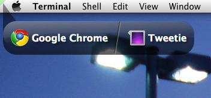
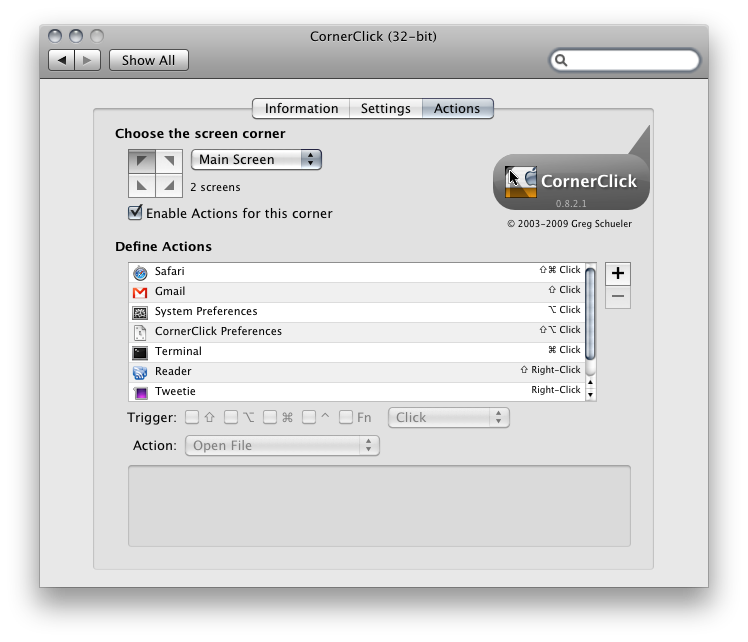
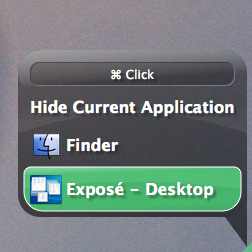

Screenshots
======

* Right and Left click actions with the same modifiers:  

- - -

* Scroll-wheel list of available actions:  

 

* Shown with adjusted font and icon size:

 

- - -

* Settings in the Preference Pane

- - -

* Actions in the Preference Pane

- - -

* Expos&eacute; actions 
    

